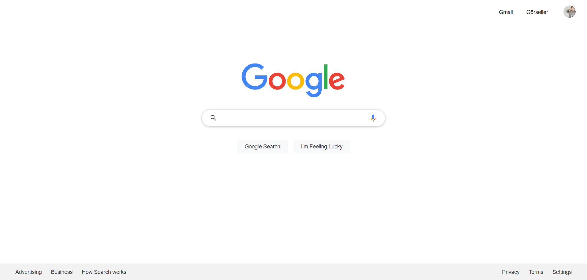

# 🌐 Google Anasayfa Klonu (2024) | Google Homepage Clone (2024)

Bu proje, **Kodluyoruz Front-End Eğitimi** kapsamında HTML ve CSS bilgilerini pekiştirmek amacıyla hazırlanmıştır.  
Modern Google anasayfasının görsel klonudur.  

This project was built as part of the **Kodluyoruz Front-End Training Program** to practice HTML and CSS.  
It is a visual clone of the modern Google homepage.

## 📸 Ekran Görüntüsü | Screenshot

## 🚀 Özellikler | Features

- Üst menüde Gmail, Görseller, uygulama ızgarası ve profil resmi  
- Ortada Google logosu ve arama çubuğu  
- Sesli arama ve büyüteç simgesi  
- “Google Search” ve “I'm Feeling Lucky” butonları  
- Alt kısımda gizlilik, reklam gibi footer bağlantıları

---

- Header with Gmail, Images, apps icon and profile picture  
- Centered Google logo and search bar  
- Voice and search icons inside input field  
- “Google Search” and “I'm Feeling Lucky” buttons  
- Footer links for privacy, advertising, etc.

## 🛠️ Kullanılan Teknolojiler | Technologies Used

- HTML5  
- CSS3  
- Google Fonts  
- SVG Icons

## 💡 Notlar | Notes

- Bu proje yalnızca görsel bir ödevdir, arama işlevi çalışmaz.  
- Kodun anlaşılabilirliği için yorum satırları eklenmiştir.  

> This is a static visual clone, search functionality is not active.  
> Code includes comments for readability.

## 📄 Lisans | License

Bu proje [MIT Lisansı](LICENSE) ile lisanslanmıştır.  
This project is licensed under the [MIT License](LICENSE).

